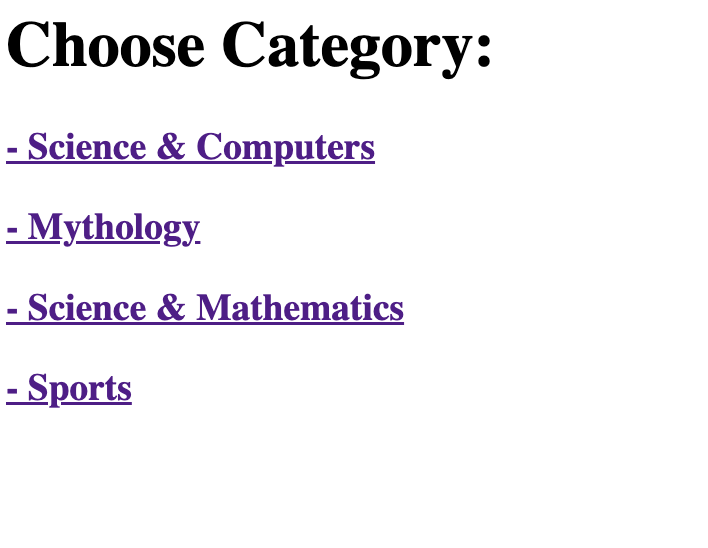

# Trivia Project API

# Description

This Trivia project allows users to test their general knowledge. The [First Big Project](https://github.com/annadruzhinina/AnnaDruzhinina-Trivia-Megan) was to create UI:

<div style="text-align:center"></div>

The Second Big project task was to create API allows you to make a sets of questions by categories.

1. GitHub Link: [https://git.generalassemb.ly/annadruzhinina/trivia-api-project](https://git.generalassemb.ly/annadruzhinina/trivia-api-project)
2. Railway Link: [https://trivia-api-production-ccb2.up.railway.app/api/](https://trivia-api-production-ccb2.up.railway.app/api/)
3. API Root Path: [http://localhost:3000/api/](http://localhost:3000/api/)
4. Open Trivia Database API: [https://opentdb.com/api_config.php](https://opentdb.com/api_config.php)

# API Navigation

For convenience, links have been provided to navigate questions set by categories.

<div style="text-align:center"></div>

Sports category : https://trivia-api-production-ccb2.up.railway.app/api/questions/category/Sports

Example of Returned json format:

```json
[
  {
    "_id": "63a5be2a4b3deaa165ff6fb5",
    "category": "Sports",
    "title": "This Canadian television sportscaster is known for his &quot;Hockey Night in Canada&quot; role, a commentary show during hockey games.",
    "type": "multiple",
    "correct_answer": "Don Cherry",
    "answers": [
      "Don McKellar",
      "Don Taylor ",
      "Donald Sutherland",
      "Don Cherry"
    ],
    "__v": 0
  },
  ...
```

# Top level APIs

/api/questions/ - CRUD for questions model

Question:

```js
let Queston = new Schema({
  category: String,
  title: String,
  type: String,
  correct_answer: String,
  answers: [String],
});
```

/api/categories/ - CRUD for categories model

Category:

```js
let Category = new Schema({
  name: String,
});
```

# Questions Routs

| Method | URL                               | Description                                                                           |
| ------ | --------------------------------- | ------------------------------------------------------------------------------------- |
| GET    | /api/questions/                   | Return all questions                                                                  |
| GET    | /api/questions/:id                | Return question by id                                                                 |
| GET    | /api/questions/category/:category | Return all questions by category. Where ':category' is String parameter, ex. 'Sports' |
| POST   | /api/questions/                   | Create new question                                                                   |
| PUT    | /api/questions/:id                | Update question by id                                                                 |
| DELETE | /api/questions/:id                | Delete question by id                                                                 |

# Category Routs

| Method | URL                 | Description           |
| ------ | ------------------- | --------------------- |
| GET    | /api/categories/    | Return all categories |
| GET    | /api/categories/:id | Return category by id |
| POST   | /api/categories/    | Create new category   |
| PUT    | /api/categories/:id | Update category by id |
| DELETE | /api/categories/:id | Delete category by id |

# Technical Notes

## Fetch & Seed

In my project I have two files fetch.js and seed.js.<br>
In fetch.js I reach and get data from [https://opentdb.com/api.php](https://opentdb.com/api.php) then create json files by category id. Each file consists of a set of questions in a specific category, ex. _questions-18.json_. The structure of questions corresponds to the model.

In seed.js file the original files are removed from the database before new json question files are uploaded.<br>

I separated the functionality of loading and storing data in order not to depend on whether the site [https://opentdb.com/api.php](https://opentdb.com/api.php) is working or not. Now I have a copy of data and can use it any time.

# Future Features

Make main page where I can see:

- Now I keep category ID in fetch.js file, in future I will get it directly from [https://opentdb.com/api.php](https://opentdb.com/api.php)
